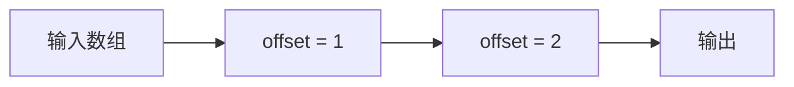

# GitHub Pages 个人博客

这是一个纯静态个人博客模板，适合直接托管到 GitHub Pages。

## 当前结构

- 顶部是 `个人简历 / 分享文章 / 项目` 三个 tab
- 首次打开默认显示欢迎页，点击 tab 后再进入对应栏目
- 左侧是文章归档列表，只显示标题和预览
- 点击归档卡片后，进入完整文章详情
- 右侧是时间轴，当前文章日期最大，其他日期会缩小并带虚化

## 目录建议

```text
.
├─ index.html
├─ styles.css
├─ app.js
├─ posts/
│  ├─ first-post.md
│  ├─ code-snippet-demo.md
│  ├─ writing-workflow.md
│  └─ project-blueprint.md
└─ assets/
   └─ posts/
```

## 在哪里添加文章

所有文章都放在 `posts/` 目录中。

例如：

- `posts/my-new-post.md`
- `posts/my-project-note.md`

也可以用脚本创建：

```bash
node scripts/new-post.js "我的新文章" --tags CUDA,Scan
```

创建草稿：

```bash
node scripts/new-post.js "还没写完的文章" --draft
```

脚本会生成 Markdown 文件，并刷新 `data/posts.json` 与 `data/post-metadata.json`。

如果你手动新增或修改文章元信息，可以运行：

```bash
node scripts/generate-posts.js
node scripts/generate-post-metadata.js
```

文章可以在文件开头写 frontmatter：

```md
---
title: "我的新文章"
date: 2026-06-14
summary: "这里写归档页显示的预览文字。"
tags: ["CUDA", "Scan"]
tab: articles
layout: single
draft: false
---
```

页面会读取自动生成的 `data/posts.json`。如果你需要集中覆盖标题、摘要、标签或栏目，可以在 `scripts/generate-posts.js` 的 `overrides` 里补配置。

## 草稿和隐藏文章

文章元信息支持两个隐藏配置：

```js
{
  slug: "my-draft",
  tab: "articles",
  title: "还没写完的文章",
  date: "2026-03-28",
  summary: "暂时不会出现在页面上。",
  tags: ["草稿"],
  file: "posts/my-draft.md",
  draft: true
}
```

- `draft: true`：草稿。部署时不会进入公开 `data/posts.json`；本地用 `INCLUDE_DRAFTS=true node scripts/generate-posts.js` 可以预览。
- `hidden: true` 或 `visible: false`：隐藏文章，效果同草稿。

直接访问被隐藏文章的链接时，页面会回到对应栏目的归档列表。

## 文章目录

文章详情页会根据正文里的 `##` 和 `###` 自动生成目录，显示在正文左侧。窄屏下目录会移动到正文上方。

## 文章布局

默认文章是单列阅读。需要整篇文章使用左右两列时，在 `scripts/generate-posts.js` 的 `overrides` 里给文章加：

```js
layout: "two-column"
```

然后在 Markdown 里用标准 HTML 注释标记每一组左右对照：

```md
<!-- row -->

左侧这一组内容，可以放图、示意、数据变化过程。

<!-- column -->

右侧这一组内容，可以放对应代码、解析、推导。

<!-- row -->

下一组左侧内容。

<!-- column -->

下一组右侧内容。
```

没有配置 `layout` 时会继续使用单列。

## Mermaid 图

文章支持 Mermaid，适合快速画流程图、依赖图和状态图：

````md

````

Mermaid 适合表达结构关系；如果需要精确几何控制，建议用 LaTeX/TikZ 或 SVG 图片。

## 部署前检查

推送前可以运行：

```bash
node scripts/check-site.js
```

它会检查文章文件、重复 slug、两列文章的 `row/column` 标记、空 Mermaid 块和失效本地图片引用。

## 行内背景高亮

正文里可以用扩展语法给一小段文字加背景色：

```md
==默认高亮==
==blue:蓝色高亮==
==warn:警示高亮==
```

高亮颜色配置在：

- `data/highlight-styles.json`

每个高亮样式都需要同时配置 `background` 和 `text`，确保文字和背景有明显区分。配置按浅色/深色主题拆开：

```json
{
  "blue": {
    "light": {
      "text": "#06245c",
      "background": "rgba(150, 196, 255, 0.66)",
      "border": "rgba(13, 107, 255, 0.2)"
    },
    "dark": {
      "text": "#061835",
      "background": "rgba(190, 218, 255, 0.92)",
      "border": "rgba(190, 218, 255, 0.34)"
    }
  }
}
```

## 如何归档到不同栏目

由 `tab` 字段控制：

- `tab: "resume"`：归档到 `个人简历`
- `tab: "articles"`：归档到 `分享文章`
- `tab: "projects"`：归档到 `项目`

如果你说的“归档到个人文章中”是默认个人文章区，就把它写成 `tab: "resume"`。

## 分享文章的标签筛选

`分享文章` 右侧会自动汇总 `app.js` 中文章元信息里的 `tags` 字段。新增文章时，只要在对应文章对象里写上：

```js
tags: ["Markdown", "代码"]
```

刷新页面后，新标签会自动出现在右侧标签筛选区。默认所有标签都是激活状态；第一次点击某个标签时，会只保留这个标签，后续点击则会在当前激活标签基础上继续多选或取消。右侧搜索框会同时搜索文章标题、摘要、正文和标签，并和标签筛选一起生效；命中文章正文时，左侧归档卡片会显示带高亮的上下文片段。

## 标签颜色怎么配置

特定标签的颜色配置在：

- `data/tag-styles.json`

按标签名配置浅色和深色两套颜色：

```json
{
  "Markdown": {
    "light": {
      "text": "#7c3aed",
      "background": "rgba(124, 58, 237, 0.12)",
      "border": "rgba(124, 58, 237, 0.22)",
      "glow": "rgba(124, 58, 237, 0.14)"
    },
    "dark": {
      "text": "#ddd6fe",
      "background": "rgba(167, 139, 250, 0.18)",
      "border": "rgba(221, 214, 254, 0.28)",
      "glow": "rgba(167, 139, 250, 0.2)"
    }
  }
}
```

没有配置的标签会继续使用默认颜色。

## 是否显示文章日期

文章日期显示开关在：

- `data/site-config.json`

默认关闭：

```json
{
  "showArticleDates": false,
  "showTimelineDates": true,
  "dateSource": "generated",
  "generatedDateField": "createdAt"
}
```

把 `showArticleDates` 改成 `true` 后，归档卡片和文章详情会显示日期。右侧时间轴由 `showTimelineDates` 单独控制，默认保持显示日期。

`dateSource` 可选：

- `generated`：读取 `data/post-metadata.json`，这个文件由 `scripts/generate-post-metadata.js` 从 Git 记录自动生成。
- `metadata`：读取 `app.js` 文章元信息里的 `date` 字段。

`generatedDateField` 可选：

- `createdAt`：文章文件第一次进入 Git 的时间。
- `updatedAt`：文章文件最近一次提交修改的时间。

本仓库已经包含 GitHub Pages workflow。每次 push 到 `master` 时，会自动运行生成脚本并部署静态站点；本地需要手动刷新生成文件时，可以运行：

```bash
node scripts/generate-posts.js
node scripts/generate-post-metadata.js
```

首页的 GitHub 风格更新格子图也读取这份生成文件，按 `updatedAt` 统计 `分享文章` 和 `项目` 两个栏目的更新。

## 在哪里保存图片

建议把文章图片放在：

- `assets/posts/文章slug/图片名`

例如：

- `assets/posts/my-new-post/cover.jpg`
- `assets/posts/my-new-post/screenshot.png`

## Markdown 里怎么插图

因为文章文件在 `posts/` 目录下，所以推荐这样引用图片：

```md

```

或：

```md

```

页面已经支持 Markdown 图片展示，图片会自动按正文宽度显示。

## 文章里怎么添加浮窗注释

浮窗文字统一写在：

- `posts/tooltips.json`

格式示例：

```json
{
  "长期写作": "把写作当成持续整理和复盘的入口，而不是一次性的发布动作。",
  "轻量流程": "保留必要步骤，减少维护负担，让内容更容易持续更新。"
}
```

在文章正文里标识需要浮窗的字：

```md
这是一个[[长期写作]]入口。
```

页面渲染时只会显示“长期写作”，不会显示 `[[` 和 `]]`。鼠标悬停在这几个字上时，会显示 `posts/tooltips.json` 里对应的短文字。

如果页面显示的文字和配置 key 不一样，可以这样写：

```md
这是一个[[写作入口|长期写作]]。
```

页面显示“写作入口”，浮窗读取 `长期写作` 对应的内容。没有用 `[[...]]` 标出来的词不会自动显示浮窗。

## 首页技能菱形怎么修改

首页技能菱形的数据写在：

- `data/skills.json`

每个技能项包含：

```json
{ "label": "C++", "weight": 10 }
```

`weight` 范围建议保持在 `1` 到 `10`：

- `8-10`：中心大字体
- `4-7`：中间过渡字体
- `1-3`：外围小字体

页面会按 `weight` 连续计算字号，不是只有大/小两个档位。权重越大，越靠近菱形中心，字体也越大。

## 本地预览

因为页面通过 `fetch` 加载 Markdown 文件，不能直接双击 `index.html` 用 `file://` 方式预览。

如果你继续使用 WSL2，可以在项目目录启动：

```bash
python3 -m http.server 8001
```

然后访问 `http://127.0.0.1:8001`。

## 部署到 GitHub Pages

1. 把项目推送到 GitHub 仓库。
2. 打开仓库的 `Settings` -> `Pages`。
3. 在 `Build and deployment` 中选择：
   - `Source`: `Deploy from a branch`
   - `Branch`: 你的主分支，例如 `main` 或 `master`
   - `Folder`: `/ (root)`
4. 保存后等待 GitHub Pages 发布完成。

## 如何让我读取 LaTeX 简历

把你的简历文件放到项目里，建议使用以下路径：

- `resume/source/resume.tex`
- `resume/source/resume.pdf`（可选，用于对照版式）

然后告诉我这两个文件路径，我就可以：

1. 读取 LaTeX 内容并提取简历结构
2. 在网页端复刻关键布局与层级
3. 把第一栏 `个人简历` 填成正式版本

如果你不想移动原文件，也可以直接把 `.tex` 内容贴给我。
