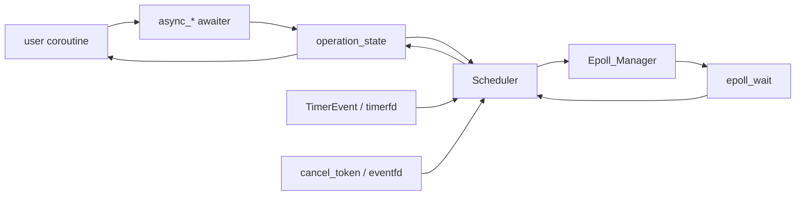

# async_io_framework

这是一个偏底层的 C++ async I/O framework。它的展示重点不应该是“做了一个网络库”，而应该是：如何把 socket readiness、coroutine suspension、timer、timeout 和 cancellation 放进同一个调度模型里。

项目仓库：[bielaiii/async_io_framework](https://github.com/bielaiii/async_io_framework)

## 项目定位

这个项目目前更像一个“异步运行时骨架”，核心目标是用尽量薄的抽象包住 Linux I/O readiness，同时保留 coroutine 风格的可组合性。

README 里已经标记完成的能力包括：

- `async_connect`
- `async_accept`
- `async_write`
- `async_read`
- timer / `wait_for`
- `async_read_some`
- 异步读写取消

## 核心结构



这一层关系很适合在项目页里展示，因为它能解释项目的真实难点：不是“调用 epoll”，而是多个事件源同时竞争同一个 coroutine 的完成权。

## 能力矩阵

| 能力 | 当前状态 | 说明 |
| --- | --- | --- |
| connect / accept | 已支持 | 面向 socket 建连与接入 |
| read / write | 已支持 | 通过 `Scheduler` 注册 fd readiness |
| read_some | 已支持 | 不要求填满 buffer |
| timeout | 已支持 | I/O 操作可与 timer 竞争 |
| wait_for | 已支持 | coroutine 级 timer await |
| cancellation | 已支持 | 使用 eventfd 主动唤醒 scheduler |
| single read/write waiter | 当前限制 | 同一 socket fd 保持单读槽、单写槽 |

## 调度路径

`Scheduler` 维护 fd 到 pending operation 的关系。socket fd 目前是简单的单读槽、单写槽模型：

```text
socket fd -> read_op*
socket fd -> write_op*
```

当 `epoll_wait` 返回事件后，scheduler 会根据 `EPOLLIN / EPOLLOUT / ERR / HUP` 找到对应 operation，并调用 `complete()` 让 coroutine 恢复。

这个设计适合展示成项目卡片里的“核心抽象”，因为它很清楚地说明了框架边界：

- scheduler 只负责 readiness dispatch
- operation state 负责完成结果仲裁
- coroutine 负责恢复后做清理和返回结果

## 取消设计

仓库里的 active cancellation 设计文档很关键。它不是简单设一个 cancelled flag，而是让 `cancel_token` 持有一个 `eventfd`：

```text
request_cancel()
  -> write(cancel eventfd)
  -> epoll_wait 被唤醒
  -> Scheduler dispatch cancel read_op
  -> operation_state 尝试变成 CANCELLED
  -> coroutine resume 并清理 fd interest
```

这个设计比 lazy cancellation 更适合 I/O 场景，因为一个 pending read/write 之后可能再也没有 socket readiness。如果取消不能唤醒 `epoll_wait`，coroutine 就可能永远没有机会观察到取消请求。

## Timer 设计

timer 部分现在使用一个 Linux `timerfd` 驱动多个 coroutine timer。设计文档里已经记录了一个重要演进点：

- 当前模型会把当前 timer task 暴露给 scheduler
- timerfd 事件按调度器事件推进
- 不把多个 expired timers 包装成单独的批量 dispatcher

这说明项目已经开始进入“事件循环内部质量”的问题，而不只是 API 层演示。

## 测试覆盖

仓库目前有 `Catch2` 单元测试，已经覆盖了几条关键路径：

- `async_read` 能读取已经 ready 的 fd
- `async_write` 能写完整个 buffer
- `async_connect` 能连接本地 TCP listener
- `wait_for` 能完成 timer await
- `async_read_timeout` 能返回 timeout
- cancellation 能让 pending read 以 cancelled 结束
- `StaticBuffer / DynamicBuffer / Buffer_View` 的 offset、remain、reuse 行为

这些测试很适合在项目页里单独展示，因为它们能让读者快速判断：这个项目已经有真实行为验证，而不是只有接口草图。

## 展示建议

项目 tab 里这个项目应该用“系统框架卡片”展示：

- 标题：`async_io_framework`
- 一句话：C++20 coroutine + epoll 的 async I/O framework
- 标签：`coroutine`、`epoll`、`timerfd`、`eventfd`、`Catch2`
- 指标：`async I/O runtime`、`timeout/cancel`、`event arbitration`
- 入口：GitHub 仓库

详情页则不要写成长教程，而是保持这个结构：定位、核心结构、能力矩阵、调度路径、取消设计、timer 设计、测试覆盖。
