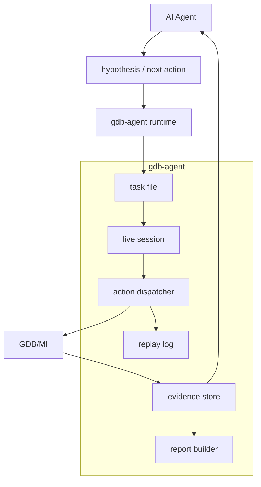
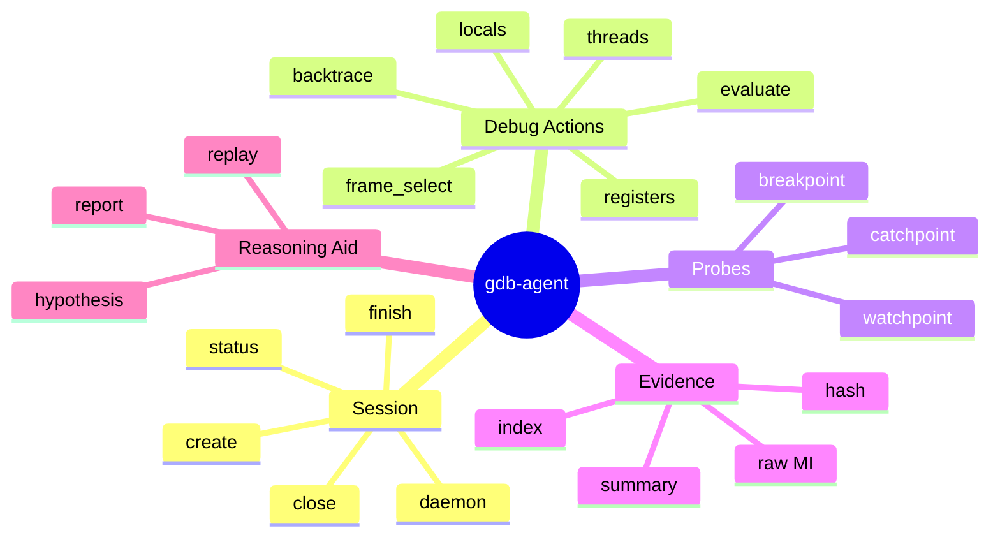
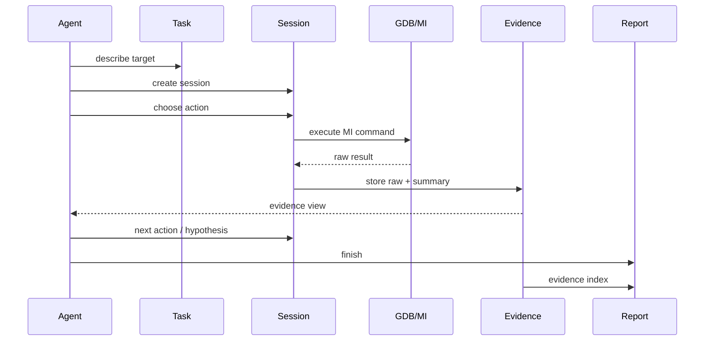
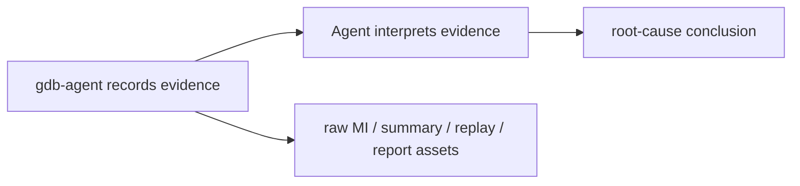

# gdb-agent

`gdb-agent` 是 vibe-coding 推出来的调试工具：先让 Agent 快速提出假设和动作，再让工具稳定执行 GDB/MI、维护 session、保存 evidence，并生成可审计的报告资产。

项目仓库：[bielaiii/gdb_cli_tools](https://github.com/bielaiii/gdb_cli_tools)

## Architecture

这张图是项目的主体：`gdb-agent` 位于 Agent 和 GDB/MI 之间，不抢推理职责，只稳定地执行动作、收集证据、沉淀会话。

## Capabilities

功能展示可以按“面向 Agent 的能力面”来组织，而不是堆命令清单：

| 能力面 | 支持内容 |
| --- | --- |
| Session runtime | daemon、create、action、status、finish、close |
| Debug action | backtrace、locals、registers、threads、evaluate、frame_select |
| Probe control | breakpoint、watchpoint、catchpoint、probe enable/disable/delete |
| Evidence flow | raw MI、低噪声 summary、index、raw hash |
| Agent workflow | hypothesis create/check/conclude、replay、report |

## Flow

这个 flow 说明了项目最重要的边界：Agent 可以多轮探索，但每一步都落在 session log 和 evidence store 里。最后报告不是凭空生成，而是引用已经保存的证据。

## Boundaries

设计边界保持清楚：

- 目标平台是 Linux。
- 调试执行通过 GDB/MI，不走 PTY。
- `raw_mi` 是 escape hatch，而不是默认交互方式。
- replay 重放的是高层 action，不是恢复旧 GDB 进程。
- 工具记录证据，最终根因判断属于 Agent。
