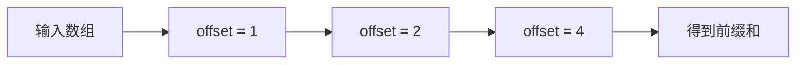

# 博客文章效果与语法演示

这篇文章专门用来展示博客支持的写法。它使用两列布局：每一个 `<!-- row -->` 是一组左右对照，组内用 `<!-- column -->` 分隔左侧和右侧。

<!-- row -->

## 1. 两列对照布局

左侧可以放概念、图示、过程说明，右侧放对应代码或解释。

```text
<!-- row -->

左侧内容

<!-- column -->

右侧内容
```

每一组 `row` 会独立对齐，不会出现“左边写完再轮到右边”的阅读错位。

<!-- column -->

## 对应语法

```md
<!-- row -->

### 左侧标题

这里写左侧内容。

<!-- column -->

### 右侧标题

这里写右侧内容。
```

这种写法本质上仍然是标准 Markdown 加 HTML 注释，兼容性比自定义代码块更好。

<!-- row -->

## 2. 代码块与折叠

普通代码块会自动高亮，并在左上角显示折叠按钮。

```cpp
for (int offset = 1; offset < blockDim.x; offset <<= 1) {
  float add = 0.0f;
  if (tid >= offset) {
    add = scratch[tid - offset];
  }
  __syncthreads();
  scratch[tid] += add;
  __syncthreads();
}
```

<!-- column -->

## 对应语法

````md
```cpp
for (int offset = 1; offset < blockDim.x; offset <<= 1) {
  scratch[tid] += scratch[tid - offset];
}
```
````

语言名写在代码块开头，例如 `cpp`、`js`、`text`。页面会根据语言显示标签和高亮。

<!-- row -->

## 3. 行内高亮

可以用 `==内容==` 标出重点，也可以指定颜色：

- ==默认高亮==
- ==blue:蓝色高亮==
- ==warn:警示高亮==

适合标出循环不变量、关键边界条件或一段证明里的核心结论。

<!-- column -->

## 对应语法

```md
==默认高亮==
==blue:蓝色高亮==
==warn:警示高亮==
```

高亮颜色来自 `data/highlight-styles.json`。

<!-- row -->

## 4. 行内术语提示

如果 `posts/tooltips.json` 里配置了术语解释，可以在正文里写：

[[scan]]

[[prefix sum|scan]]

鼠标悬停或键盘聚焦时会看到提示。

<!-- column -->

## 对应语法

```md
[[scan]]

[[显示文字|术语key]]
```

第一种写法用显示文字当 key；第二种写法可以把显示文字和 key 分开。

<!-- row -->

## 5. 表格

| 轮数 | offset | 覆盖范围 |
| ---- | -----: | -------- |
| 0    |      1 | 2 个元素 |
| 1    |      2 | 4 个元素 |
| 2    |      4 | 8 个元素 |

表格适合展示算法每轮状态变化。

<!-- column -->

## 对应语法

```md
| 轮数 | offset | 覆盖范围 |
| ---- | -----: | -------- |
| 0    |      1 | 2 个元素 |
| 1    |      2 | 4 个元素 |
| 2    |      4 | 8 个元素 |
```

列对齐符号里的 `:` 可以控制文字对齐方向。

<!-- row -->

## 6. Mermaid 图

Mermaid 适合快速画流程图、依赖图和状态图。



<!-- column -->

## 对应语法

````md

````

它更适合表达结构关系，不适合像 TikZ 那样做精确几何绘图。
